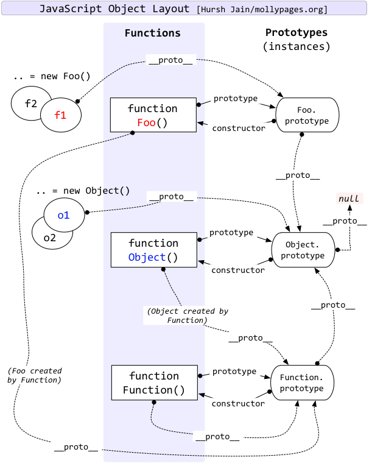

# JavaScript 语言精髓

## 类型

- Primitive
  - Boolean
  - Number
  - String
  - null
  - undefined
  - Symbol
- Object

## 变量

```js
// 声明
var a = 1; // 函数作用域, 变量提升
let b = 2; // 块作用域
const c = 3; // 块作用域
d = 4; // 全局作用域
```

## 块级作用域实现

```javascript
/* ES5 */
try {
  throw 1;
} catch (a) {
  alert(a); // 1
}
alert(a); // is not defined
```

## 变量提升

```js
function fn() {
  if (false) {
    var a = 1;
  }
  alert(a);
}
// 相当于
function fn() {
  var a; // var为函数级作用域
  if (false) {
    a = 1;
  }
  alert(a); // undefined
}
```

## 函数

```js
// 函数声明提升优先
console.log(typeof v); // function
var v = 9;
console.log(typeof v); // number
function v() {}
console.log(typeof v); // number
// 等于:
function v() {}
var v;
console.log(typeof v); // function
v = 9;
console.log(typeof v); // number
console.log(typeof v); // number
```

```js
// 严格模式 限制内部直接出现的`this`隐式指window
(function f() {
  "use strict";
  function fn() {
    console.log(this); // undefined
  }
  fn();
})();
//----------------------------------
function fn() {
  console.log(this); // window
}
(function f() {
  "use strict";
  fn();
})();
```

```js
// 块级函数名保护
function f() {
  f = 1;
}
f();
console.log(typeof f); // number
console.log(typeof f); // number
//!!!!!!!!!!!!!!!!!!!!!!!!!!!!!!!!!!
{
  function f() {
    f = 1;
  }
  f();
  console.log(typeof f); // number
}
console.log(typeof f); // function
```

```js
// 函数作表达式时外部不可获取函数名
if (function f() {}) {
  console.log(typeof f); // undefined
}
//----------------------------------------
var fn = function f() {
  // 内部可获取
  console.log(typeof f); // function
};
console.log(typeof f); // undefined
fn();
//----------------------------------------
(function f() {
  console.log(typeof f); // function
})();
console.log(typeof f); // undefined
```

## 闭包垃圾回收

```javascript
function fn() {
  var a = 1; // 回收
  return function() {
    alert(1);
  };
}

// eval: 不对LexicalEnvironment进行任何的解绑
function fn() {
  var a = 1; // 不回收
  return function() {
    eval(""); // 因为无法静态分析
  };
}

function fn() {
  var a = 1; // 回收
  return function() {
    window.eval("");
  };
}

// with: 放弃全部变量的回收
var outter = {
  age: 20
};
with (outter) {
  name = "name";
}
console.log(name); // name

// try..catch(ex): 不会回收ex
// ex是未定义变量 -> 延长了作用域链, 引用LexicalEnvironment
try {
  throw new Error("");
} catch (ex) {}

// new Function(" "): scope LexicalEnvironment
// new Function(字符串) 绑定全局
var test = "outter";
function init() {
  var test = "inner";
  var fn = new Function("console.log(test)");
  fn(); // outer
}
init();
// new Function(立即执行的函数) 绑定当前
var test = "outter";
function init() {
  var test = "inner";
  new Function(console.log(test)); // inner
}
init();
```

## 原型链

```javascript
function fn() {
  this.a = 1;
}
fn.prototype.a = 2;
var obj = new fn();
alert(obj.a); // 1  constructor优先(fn.prototype.constructor === fn)
```

```js
function P() {}
var c = new P();
c.__proto__ === P.prototype;
```



## 继承

> 子类得到父类属性、方法, 且保留 constructor

## 作用域链

```js
var name = "global";
function A(name) {
  alert(name);
  this.name = name;
  var name = "1";
}
A.prototype.name = "2";
var a = new A("3"); // '3'

alert(a.name); // '3'
delete a.name; // -> delete a.__proto__.name
alert(a.name); // '2'
```

```js
function fun(n, o) {
  console.log(o);
  return {
    fun: function(m) {
      return fun(m, n);
    }
  };
}

var a = fun(0);

a.fun(1);
a.fun(2);

var b = fun(0)
  .fun(1)
  .fun(2)
  .fun(3);

var c = fun(0).fun(1);

c.fun(2);
c.fun(3);
```

## this

> 指向调用者

```js
function test() {
  alert(this.m === undefined);
}
test(); // true, 指向window
window.test(); // true, 指向window

this.m = 1000;
var o = {
  m: 500,
  test: function() {
    alert(this.m);
    return function() {
      alert(this.m);
    };
  }
};
var f = o.test(); // 500, 指o
f(); // 1000, 指window
```
